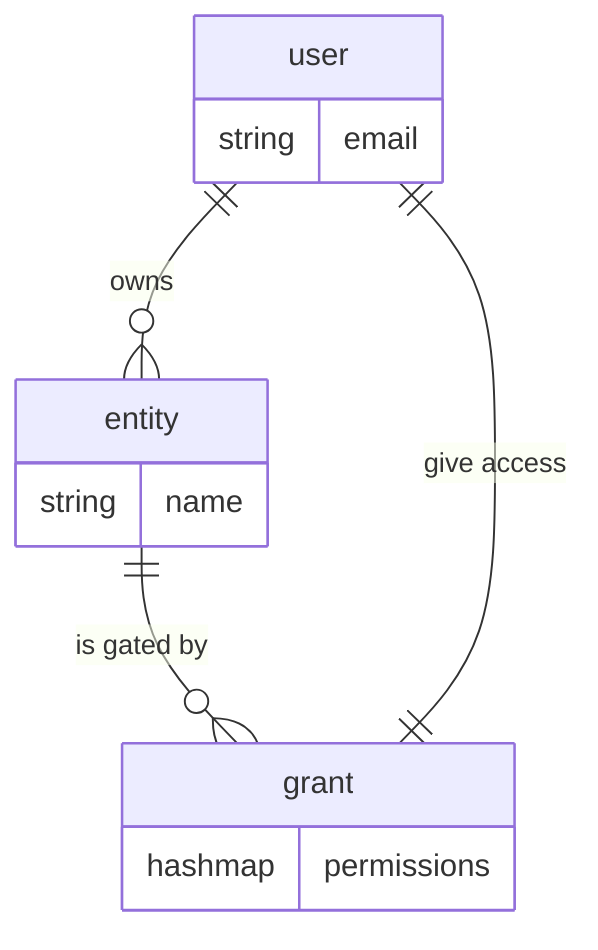
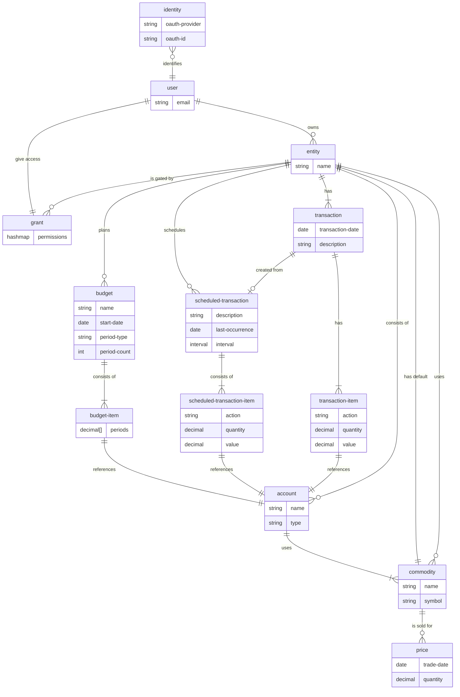

# Entities in the System

## The basics

## Grants

```mermaid
erDiagram
  user ||--o{ entity : owns
  entity ||--o{ grant : "is gated by"
  grant ||--|| user : "give access"
  user {
    string email
  }
  entity {
    string name
  }
  grant {
    hashmap permissions
  }
```

## Everything

```mermaid
erDiagram
  user ||--o{ entity : owns
  identity }o--|| user : identifies
  entity ||--o{ account : "consists of"
  entity ||--o{ commodity : uses
  entity ||--|| commodity : "has default"
  commodity ||--o{ price : "is sold for"
  entity ||--o{ grant : "is gated by"
  grant ||--|| user : "give access"
  account ||--|{ commodity : uses
  entity ||--|{ transaction : has
  transaction ||--|{ transaction-item : has
  transaction-item ||--|| account : references
  transaction ||--o| scheduled-transaction : "created from"
  entity ||--o{ scheduled-transaction : schedules
  scheduled-transaction ||--|{ scheduled-transaction-item : "consists of"
  scheduled-transaction-item ||--|| account : references
  entity ||--o{ budget : plans
  budget ||--|{ budget-item : "consists of"
  budget-item ||--|| account : references
  identity {
    string oauth-provider
    string oauth-id
  }
  user {
    string email
  }
  entity {
    string name
  }
  commodity {
    string name
    string symbol
  }
  price {
    date trade-date
    decimal quantity
  }
  account {
    string name
    string type
  }
  transaction {
    date transaction-date
    string description
  }
  transaction-item {
    string action
    decimal quantity
    decimal value
  }
  scheduled-transaction {
    string description
    date last-occurrence
    interval interval
  }
  scheduled-transaction-item {
    string action
    decimal quantity
    decimal value
  }
  budget {
    string name
    date start-date
    string period-type
    int period-count
  }
  budget-item {
    decimal[] periods
  }
  grant {
    hashmap permissions
  }
```
