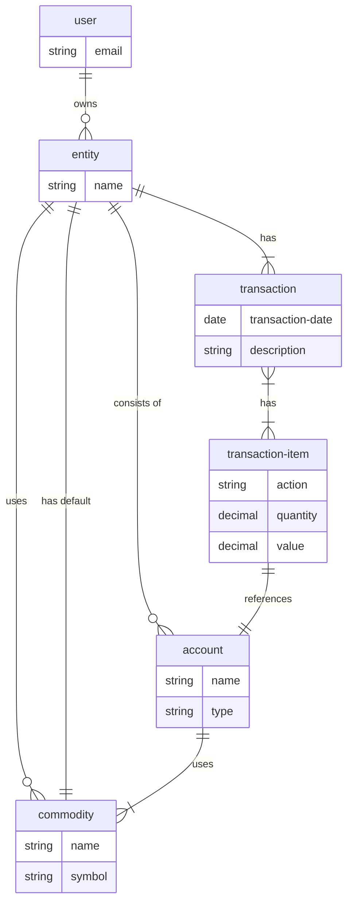

# clj-money
Clojure cloud accounting application


## ERD
These are the essential entities of the system.

See more at [ERD.md](ERD.md)

## Running locally

### Setup the database:
You'll need PostgreSQL installed.

```bash
createdb money_development
lein migrate
lein partition <start-date> <end-date>

createdb money_test
lein with-profile test migrate
lein with-profile partition 2015-01-01 2017-12-31
```

### Start local services
Create a `env/dev/config.edn` file with the following:
```clojure
{:dev? true
 :google-client-id "<look it up>"
 :google-client-secret "<look it up>"}
```
Start the web server with
```bash
lein repl
```
then
```clojure
(start-server)
```
To stop
```clojure
(stop-server)

```
Start the client with:
```bash
lein fig:wheel
```
Stop the client with:
```
:cljs/quit
```

## Running on Heroku
```bash
heroku create my-app-name
heroku addons:create heroku-postgres:hobby-dev
heroku config:set DB=<value of DATABASE_URL> PARTITION_PERIOD=year
git push heroku master
heroku run lein migrate
heroku run lein partition <start-date> <end-date>
heroku open
```

## Running server tests
```bash
createdb money_test
lein with-profile test migrate
lein with-profile test partition 2015-01-01 2017-12-31
lein test
```

## Running client tests
```bash
lein fig:test
```

## License
Distributed under the Eclipse Public License, the same as Clojure.
