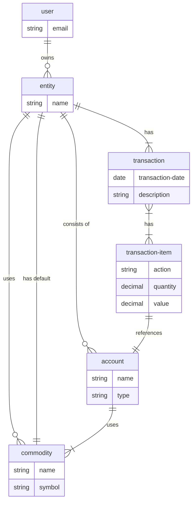

# clj-money
Clojure cloud accounting application


## ERD
These are the essential entities of the system.

See more at [ERD.md](ERD.md)

## Running locally

### Running services
```bash
docker compose up -d
```

### Setup the database:
```bash
lein do create-sql, migrate, <start-date> <end-date>

lein with-profile test do create-sql, migrate, partition 2015-01-01 2017-12-31
```

### Start local services
Create a `env/dev/config.edn` by copying `env/test/config.edn` and changing
- The datbase details (should be just the dbname)
- The image storage details (should be just the dbname)
- The Google OAuth keys
  - `:google-client-id`
  - `:google-client-secret`
- Add `:dev? true`
- Remove `:test? true`
- Change `:site-protocol` to "http"

*To run in a docker container, do the above, but copy to `env/docker/config.edn`*

Start the web server with
```bash
lein repl
```
then
```clojure
(start-server)
```
To stop
```clojure
(stop-server)

```
Compile the sass files with:
```bash
npm install -g sass # if not already installed
sass --watch src/scss/site.scss resources/public/css/site.css
```
Start the client with:
```bash
lein fig:build
```
Stop the client with:
```
:cljs/quit
```

## Running server tests
```bash
lein test
```

Ignore a storage strategy
```bash
IGNORE_STRATEGY=:sql lein test
```

Specify a strategy for a single test
```clojure
(dbtest create-a-resource {:only :sql}
  (rest-of-the-test :goes-here)

; You can specify a single strategy or multiple
(dbtest update-a-resource {:exclude #{:sql}}
  (rest-of-the-test :goes-here)
```

## Running client tests
```bash
lein fig:test
```

## License
Distributed under the Eclipse Public License, the same as Clojure.
