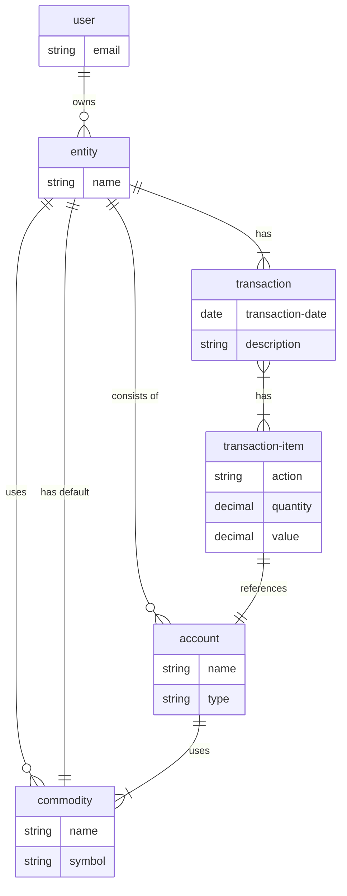

# clj-money
Clojure cloud accounting application


## ERD
These are the essential entities of the system.

```mermaid
erDiagram
  user ||--o{ entity : owns
  entity ||--o{ account : "consists of"
  entity ||--o{ commodity : uses
  entity ||--|| commodity : "has default"
  account ||--|{ commodity : uses
  entity ||--|{ transaction : has
  transaction }|--|{ transaction-item : has
  transaction-item ||--|| account : references
  user {
    string email
  }
  entity {
    string name
  }
  commodity {
    string name
    string symbol
  }
  account {
    string name
    string type
  }
  transaction {
    date transaction-date
    string description
  }
  transaction-item {
    string action
    decimal quantity
    decimal value
  }
```
See more at [ERD.md](ERD.md)

## Running locally

### Running services
```bash
docker compose up -d
```

### Setup the database:
```bash
lein do create-sql, migrate, migrate-auxiliary, partition <start-date> <end-date>

lein with-profile test do create-sql, migrate, migrate-auxiliary, partition 2015-01-01 2017-12-31
```

### Start local services
Create a `env/dev/config.edn` by copying `env/test/config.edn` and changing
- The datbase details (should be just the dbname)
- The image storage details (should be just the dbname)
- The Google OAuth keys
  - `:google-client-id`
  - `:google-client-secret`
- Add `:dev? true`
- Remove `:test? true`
- Change `:site-protocol` to "http"

### Running with Docker (Podman)

Create a `.env` file in the project root (see `.env` for an example) with at
minimum:
```bash
REDIS_PASSWORD=...
SQL_ADM_USER=...   SQL_ADM_PASSWORD=...
SQL_DDL_USER=...   SQL_DDL_PASSWORD=...
SQL_APP_USER=...   SQL_APP_PASSWORD=...
SQL_DB_NAME=...
SQL_HOST=sql
DATOMIC_DB_NAME=...
```

Create `env/docker/config.edn` (this file is gitignored, so credentials are
safe). Use the structure below, substituting your own credential values. Host
names (`sql`, `redis`) are the Docker Compose service names and should not
change.

```edn
{:application-name "clj-money"
 :db {:strategies {:sql
                   {:clj-money.db/strategy :clj-money.db/sql
                    :host "sql"
                    :port 5432
                    :user "<sql-app-user>"
                    :password "<sql-app-password>"
                    :dbtype "postgresql"
                    :dbname "<sql-db-name>"}

                   :datomic-peer
                   {:clj-money.db/strategy :clj-money.db/datomic-peer
                    :uri "datomic:sql://<datomic-db-name>?jdbc:postgresql://sql:5432/datomic?user=<sql-app-user>&password=<sql-app-password>"}}
      :active :datomic-peer}
 :image-storage {:clj-money.images/strategy :clj-money.images/sql
                 :host "sql"
                 :port 5432
                 :user "<sql-app-user>"
                 :password "<sql-app-password>"
                 :dbtype "postgresql"
                 :dbname "<sql-db-name>"}
 :mailer-host "localhost"
 :mailer-from "no-reply@clj-money.com"
 :partition-period :year
 :progress {:strategies {:redis {:clj-money.progress/strategy :clj-money.progress/redis
                                 :prefix "docker"
                                 :redis-config {:host "redis"
                                                :port 6379
                                                :password "<redis-password>"}}}
            :active :redis}
 :secret "<app-secret>"
 :site-host "localhost"
 :site-protocol "http"
 :sql-adm-user "<sql-adm-user>"
 :sql-adm-password "<sql-adm-password>"
 :sql-app-user "<sql-app-user>"
 :sql-app-password "<sql-app-password>"
 :sql-db-name "<sql-db-name>"
 :sql-ddl-user "<sql-ddl-user>"
 :sql-ddl-password "<sql-ddl-password>"
 :sql-host "sql"}
```

Then bring up the stack with the desired profile:

Datomic Peer
```bash
podman-compose --profile datomic-peer up
```

PostgreSQL
```bash
podman-compose --profile sql up
```

Start the web server with
```bash
lein repl
```
Or, if you want to work with OpenTelemetry integration:
  - download the [java agent](https://github.com/open-telemetry/opentelemetry-java-instrumentation/releases/latest/download/opentelemetry-javaagent.jar), if not already downloaded
    ```bash
    curl ./scripts/download-otel
    ```
  - start the server with:
    ```bash
    lein with-profile +otel repl
    ```
then
```clojure
(start-server)
```
To stop
```clojure
(stop-server)

```
Compile the sass files with:
```bash
npm install -g sass # if not already installed
sass --watch src/scss/site.scss resources/public/css/site.css
```
Start the client with:
```bash
lein fig:build
```
Stop the client with:
```
:cljs/quit
```

## Running server tests
```bash
lein test
```

Ignore a storage strategy
```bash
IGNORE_STRATEGY=:sql lein test
```

Specify a strategy for a single test
```clojure
(dbtest create-a-resource {:only :sql}
  (rest-of-the-test :goes-here)

; You can specify a single strategy or multiple
(dbtest update-a-resource {:exclude #{:sql}}
  (rest-of-the-test :goes-here)
```

## Running client tests
```bash
lein fig:test
```

## License
Distributed under the Eclipse Public License, the same as Clojure.
