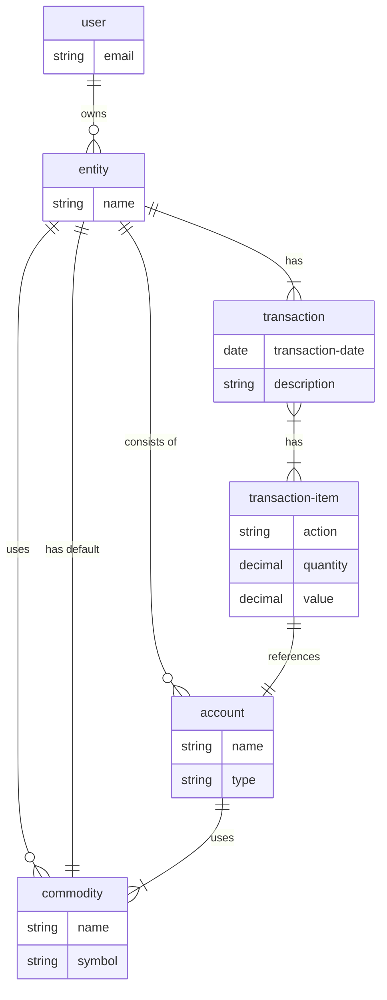

# clj-money

Clojure cloud accounting application

## ERD

These are the essential entities of the system.

```mermaid
erDiagram
  user ||--o{ entity : owns
  entity ||--o{ account : "consists of"
  entity ||--o{ commodity : uses
  entity ||--|| commodity : "has default"
  account ||--|{ commodity : uses
  entity ||--|{ transaction : has
  transaction }|--|{ transaction-item : has
  transaction-item ||--|| account : references
  user {
    string email
  }
  entity {
    string name
  }
  commodity {
    string name
    string symbol
  }
  account {
    string name
    string type
  }
  transaction {
    date transaction-date
    string description
  }
  transaction-item {
    string action
    decimal quantity
    decimal value
  }
```

See more at [ERD.md](ERD.md)

## Documentation

- [Development mode](docs/development.md) — tools, setup, running the app locally
- [Running with Docker (Podman)](docs/docker.md) — container stack configuration
- [Production configuration](docs/production.md) — required secrets and config keys
- [Testing](docs/testing.md) — running server and client test suites

## License

Distributed under the Eclipse Public License, the same as Clojure.
