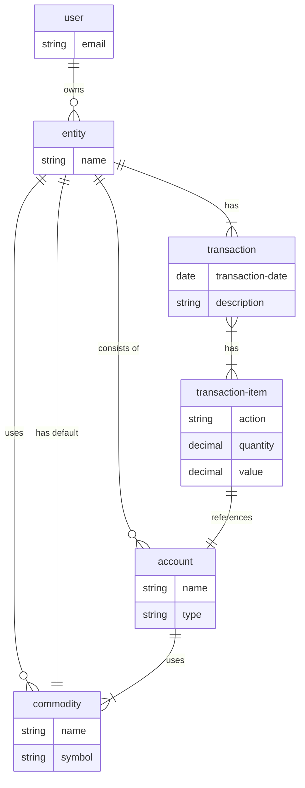

# clj-money

Clojure cloud accounting application


## ERD

These are the essential entities of the system.


```mermaid
erDiagram
  user ||--o{ entity : owns
  entity ||--o{ account : "consists of"
  entity ||--o{ commodity : uses
  entity ||--|| commodity : "has default"
  account ||--|{ commodity : uses
  entity ||--|{ transaction : has
  transaction }|--|{ transaction-item : has
  transaction-item ||--|| account : references
  user {
    string email
  }
  entity {
    string name
  }
  commodity {
    string name
    string symbol
  }
  account {
    string name
    string type
  }
  transaction {
    date transaction-date
    string description
  }
  transaction-item {
    string action
    decimal quantity
    decimal value
  }
```

See more at [ERD.md](ERD.md)

## Development mode

### Tools

1. Install [mise](https://mise.jdx.dev/getting-started.html) and run `mise install` in the project root. This installs Java, Node, lein, and clj-kondo automatically.
2. Install [Podman](https://podman.io/docs/installation) and [podman-compose](https://github.com/containers/podman-compose).

### Setup

1. Run the system setup task (requires sudo for the PostgreSQL client install):

   ```bash
   mise run deps-system
   ```

2. Create `env/dev/config.edn` and `env/docker/config.edn` by copying `env/test/config.edn` and adjusting:
   - The database details (change `:dbname` to the dev database name)
   - The image storage details (change `:dbname` to the dev database name)
   - OAuth keys: `:google-client-id` and `:google-client-secret`
   - Add `:dev? true`, remove `:test? true`
   - Change `:site-protocol` to `"http"`

   To suppress outgoing email during local development, omit `:mailer-enabled?` or set it to `false`.

3. Run the full setup task:

   ```bash
   mise run setup
   ```

   The `setup` task:
   - Starts Podman containers (datomic-peer profile: PostgreSQL, Redis, Memcached, Datomic transactor)
   - Installs Clojure and JS dependencies
   - Installs the sass CLI and does an initial compile
   - Downloads the OpenTelemetry Java agent
   - Initializes clj-kondo configs for all dependencies

   Datomic schema initialization runs automatically inside the Docker stack.

#### SQL storage strategy

If you need to work with the SQL storage strategy, also run:

```bash
mise run sql-setup
```

This creates and migrates both the development and test SQL databases.

### Running the app

Start the backend REPL:

```bash
lein repl
```

Then start/stop the server from the REPL:

```clojure
(start-server)
(stop-server)
```

Compile and watch sass:

```bash
sass --watch src/scss/site.scss resources/public/css/site.css
```

Start the ClojureScript frontend:

```bash
lein fig:build
```

Stop the client:

```clojure
:cljs/quit
```

### OpenTelemetry

The OTEL Java agent is downloaded by `mise run setup`. To use it:

```bash
lein with-profile +otel repl
```

Then start the server as usual with `(start-server)`.

## Running with Docker (Podman)

Create a `.env` file in the project root (see `.env` for an example) with at
minimum:

```bash
REDIS_PASSWORD=...
SQL_ADM_USER=...
SQL_ADM_PASSWORD=...
SQL_DDL_USER=...
SQL_DDL_PASSWORD=...
SQL_APP_USER=...
SQL_APP_PASSWORD=...
SQL_DB_NAME=...
SQL_HOST=sql
DATOMIC_DB_NAME=...
SESSION_SECRET=...
```

Create `env/docker/config.edn` (this file is gitignored, so credentials are
safe). Use the structure below, substituting your own credential values. Host
names (`sql`, `redis`) are the Docker Compose service names and should not
change.

```edn
{:application-name "clj-money"
 :alpha-vantage-key "<alpha-vantage-key-here>"
 :db {:strategies {:sql
                   {:clj-money.db/strategy :clj-money.db/sql
                    :host :config/sql-host
                    :port 5432
                    :user :config/sql-app-user
                    :password :config/sql-app-password
                    :dbtype "postgresql"
                    :dbname :config/sql-db-name}

                   :datomic-peer
                   {:clj-money.db/strategy :clj-money.db/datomic-peer
                    :uri "datomic:sql://money_development?jdbc:postgresql://localhost:5432/datomic?user=app_user&password=please01"}}
      :active :datomic-peer}
 :dev? true
 :detailed-import-logging true
 :google-client-id ""
 :google-client-secret ""
 :image-storage {:clj-money.images/strategy :clj-money.images/sql
                 :host :config/sql-host
                 :port 5432
                 :user :config/sql-app-user
                 :password :config/sql-app-password
                 :dbtype "postgresql"
                 :dbname :config/sql-db-name}
 :mailer-enabled? true
 :mailer-from "no-reply@clj-money.com"
 :mailer-host "localhost"
 :partition-period :year
 :progress {:strategies {:redis {:clj-money.progress/strategy :clj-money.progress/redis
                                 :prefix "docker"
                                 :redis-config {:host "redis"
                                                :port 6379
                                                :password :config/redis-password}}}
            :active :redis}
 :redis-password "<redis-password>"
 :secret "dev secret"
 :session-secret "session secret"
 :show-error-messages? true
 :site-host "localhost:3000"
 :site-protocol "http"
 :sql-adm-user "<sql-adm-user>"
 :sql-adm-password "<sql-adm-password>"
 :sql-app-user "<sql-app-user>"
 :sql-app-password "<sql-app-password>"
 :sql-db-name "money_development"
 :sql-ddl-user "<sql-ddl-user>"
 :sql-ddl-password "<sql-ddl-password>"
 :sql-host "localhost"}
```

When using the `datomic-peer` profile, also create
`env/docker/transactor.properties`.

```properties
host=0.0.0.0
alt-host=datomic-transactor
port=4334

ping-host=0.0.0.0
ping-port=9999

protocol=sql
sql-user=app_user
sql-password=please01
sql-url=jdbc:postgresql://sql:5432/datomic
sql-driver-class=org.postgresql.Driver

memcached=memcached:11211
memcached-auto-discovery=false

memory-index-threshold=32m
memory-index-max=512m
object-cache-max=128m
```

Then bring up the stack with the desired profile:

Basic

```bash
podman-compose up
```

Datomic Peer

```bash
podman-compose --profile datomic-peer up
```

Then run the app as described in [Development mode](#development-mode).

## Production configuration

The following configuration values have insecure defaults and **must** be set
to strong, unique values before deploying to a production environment:

| Key | Description |
|-----|-------------|
| `:secret` | JWT signing secret — use a long random string |
| `:session-secret` | Session cookie encryption key — must be exactly 16, 24, or 32 bytes |
| `:google-client-id` | Google OAuth client ID |
| `:google-client-secret` | Google OAuth client secret |
| `:redis-password` | Redis authentication password |
| `:sql-adm-password` | PostgreSQL admin user password |
| `:sql-app-password` | PostgreSQL application user password |
| `:sql-ddl-password` | PostgreSQL DDL user password |
| `:alpha-vantage-key` | Alpha Vantage API key for price data |

These can be supplied via `env/docker/config.edn` or overridden with
environment variables (e.g. `SESSION_SECRET`, `SECRET`, `REDIS_PASSWORD`).

## Running server tests

Serial

```bash
lein test
```

Parallel

```bash
lein ptest
```

Target a data storage strategy

```bash
lein test :datomic-peer
```

Specify a strategy for a single test

```clojure
(dbtest create-a-resource {:only :sql}
  (rest-of-the-test :goes-here)

; You can specify a single strategy or multiple
(dbtest update-a-resource {:exclude #{:sql}}
  (rest-of-the-test :goes-here)
```

## Running client tests

```bash
lein fig:test
```

## License

Distributed under the Eclipse Public License, the same as Clojure.
