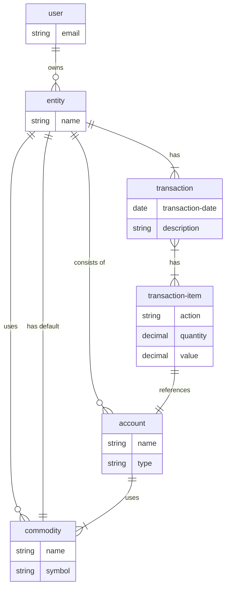

# clj-money

Clojure cloud accounting application

## ERD

These are the essential entities of the system.

```mermaid
erDiagram
  user ||--o{ entity : owns
  entity ||--o{ account : "consists of"
  entity ||--o{ commodity : uses
  entity ||--|| commodity : "has default"
  account ||--|{ commodity : uses
  entity ||--|{ transaction : has
  transaction }|--|{ transaction-item : has
  transaction-item ||--|| account : references
  user {
    string email
  }
  entity {
    string name
  }
  commodity {
    string name
    string symbol
  }
  account {
    string name
    string type
  }
  transaction {
    date transaction-date
    string description
  }
  transaction-item {
    string action
    decimal quantity
    decimal value
  }
```

See more at [Entity Relationship Diagram](https://git.dgknght.com/dgknght/clj-money/wiki/Entity-Relationship-Diagram) (wiki)

## Documentation

Documentation lives in the [wiki](https://git.dgknght.com/dgknght/clj-money/wiki):

- [Development mode](https://git.dgknght.com/dgknght/clj-money/wiki/Development-Mode) — tools, setup, running the app locally
- [Running with Docker (Podman)](https://git.dgknght.com/dgknght/clj-money/wiki/Running-with-Docker) — container stack configuration
- [Production configuration](https://git.dgknght.com/dgknght/clj-money/wiki/Production-Configuration) — required secrets and config keys
- [The Integrant system](https://git.dgknght.com/dgknght/clj-money/wiki/Integrant-System) — system components, REPL, tasks and test entry points
- [Testing](https://git.dgknght.com/dgknght/clj-money/wiki/Testing) — running server and client test suites

## License

Distributed under the Eclipse Public License, the same as Clojure.
