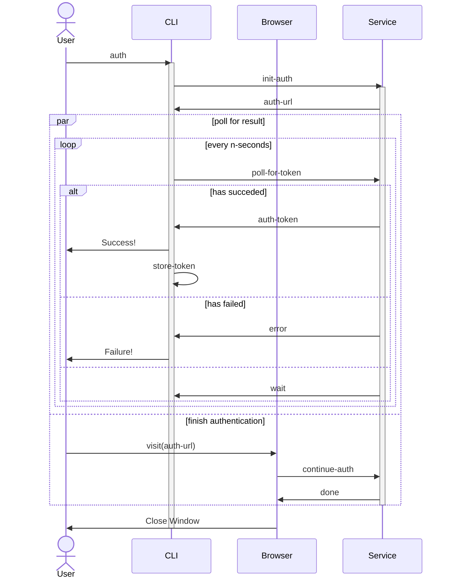

# CLI Authentication

A user can authenticate the [CLI](https://github.com/dgknght/money-cli) with
this service. The flow is as follows:

1. The user enters the command to initialize authentication at the commmand line.
2. The user is prompted to press any key to open a browser.
3. The browser opens to a resource in this service.
4. If the user is not already authenticated with this service, they are prompted
   to authenticate.
5. The user's authentication token is made available to the CLI application.
   Probably the CLI application is polling an API endpoint and waiting for 
   a response that indicates success (and includes the authentication token) or
   failure.
6. A notice is renders indicating the authentication has completed and the
   browser window can be closed.

## Notes
This is a common pattern that is used by other CLI tools. See what can be
discovered about existing implementations of this pattern. Consider the 
security implications carefully.

## Additional Requirements
Create documentation for implementing the client.

## Diagrams

